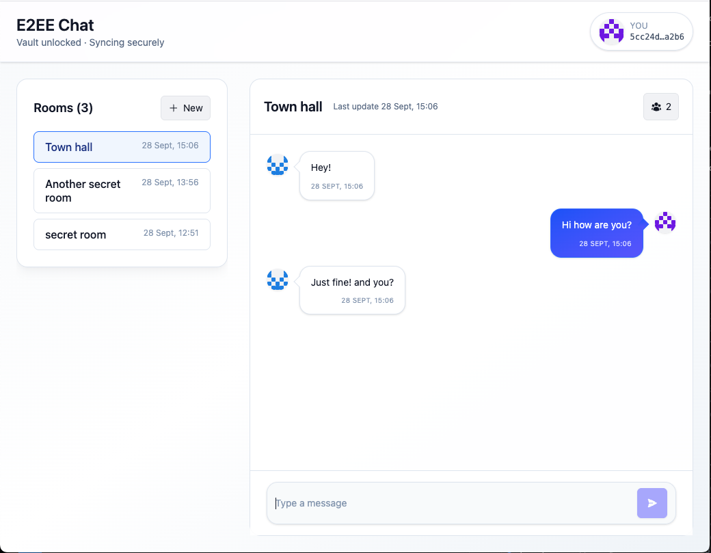

# PowerSync E2EE Monorepo

This repo contains demo applications and shared libraries for building end-to-end encrypted experiences on top of PowerSync and Supabase.

## Applications

- [packages/e2ee-chat](packages/e2ee-chat) — End-to-end encrypted group chat with guest access, room invites, and local vault unlock flows. See the package README for setup instructions and an in-depth encryption/privacy overview.

- [packages/todo-raw-table](packages/todo-raw-table) — Todo list app showcasing encrypted raw-table storage paired with decrypted mirrors for UI queries.

## Crypto packages

- [packages/crypto/interface](packages/crypto/interface) — Shared types and helpers (`CipherEnvelope`, base64 helpers, etc.) used by crypto providers.
- [packages/crypto/encrypted-sqlite](packages/crypto/encrypted-sqlite) — Encrypted↔mirror runtime for SQLite/PowerSync: pair configs, `ensurePairsDDL`, mirror orchestration, and CRUD helpers.
- [packages/crypto/password](packages/crypto/password) — Password-based crypto provider (PBKDF2 by default) implementing the `CryptoProvider` interface for wrapping/unwrapping DEKs.
- [packages/crypto/webauthn](packages/crypto/webauthn) — WebAuthn-based crypto provider using PRF/hmac-secret extensions to derive a stable secret per credential (wrap/unwrap DEKs using passkeys).

Each application consumes these packages to keep ciphertext opaque to the PowerSync backend while presenting decrypted mirrors locally for the user interface.
